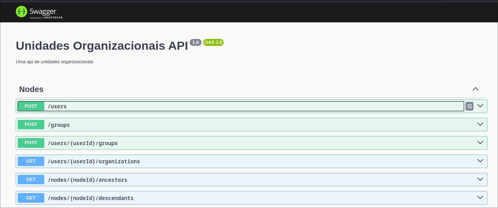

# Org Units API

Uma API de unidades organizacionais utilizando NestJS, Postgres e Bun

## Descrição

A API implementa o padrão closure table ([explicação do padrão](https://fueled.com/blog/closure-table/)) para a definição de
estrutura hierárquicas sem ciclos, de forma a compreender uma hierarquia de nós relacionados. Os nós que representamos nesta
api são usuários (User) e grupos (Groups). Um usuário pode pertencer a 0 ou mais grupos. Todo usuário deve possuir um nome e email,
e todo grupo deve possuir ao menos um nome. Um grupo pode ter até um grupo pai e 0 ou mais grupos filhos.

## Setup do projeto

### Pré-requisitos

Utilizamos o bun para gerenciamento de pacotes e runtime Typescript. Se não o possuir instalado em sua máquina, visite a documentação
oficial em [https://bun.dev](https://bun.dev). Também utilizamos o docker para conteinerização
(Veja [Setup com docker](#setup-com-docker) para mais informações). Para este projeto, é necessário possuir um
banco de dados postgres disponível.

### Rodando o projeto em desenvolvimento

Execute os seguintes passos:
1. Após clonar este projeto, crie um arquivo `.env` na raiz do projeto com a variável `DATABASE_URL` definida como a url de conexão ao banco
2. Execute o comando abaixo para instalar as dependências
  `bun install`
2. Execute o comando abaixo para executar as migrações no banco de dados
  `bun run db:push`
3. Execute o comando abaixo para iniciar o servidor de desenvolvimento
  `bun run start:dev`

### Testes automatizados

Este projeto apresenta uma suite de testes automatizados. Para os executar, execute os passos 1 e 2 da seção [Rodando o projeto em desenvolvimento](#rodando-o-projeto-em-desenvolvimento) e em seguida utilize o comando `bun run test`

### Documentação de API

A documentação de API OpenAPI 3.0 está disponível no endpoint `/docs` da API.

### Setup com docker

Se você possui o docker instalado, você pode apenas executar o comando `docker compose up` para iniciar o projeto em modo produção. Por padrão, o servidor é disponibilizado na porta 3000.
